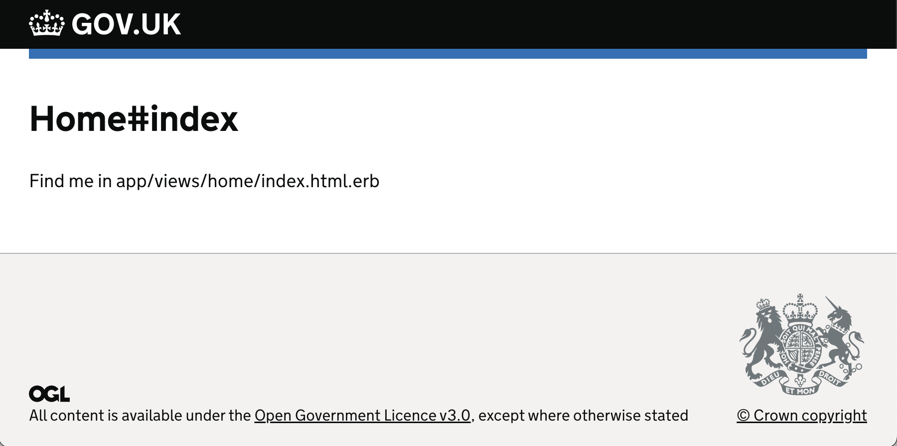

# Minimal rails GOV.UK design system application

This is a minimal rails application using the GOV.UK design system.



This uses modern (as of 2023) rails, so:

- [propshaft](https://github.com/rails/propshaft) for the asset pipeline
- [jsbundling-rails](https://github.com/rails/jsbundling-rails) and [esbuild](https://esbuild.github.io/) for bundling javascript
- [cssbundling-rails](https://github.com/rails/cssbundling-rails) and [sass](https://www.npmjs.com/package/sass) for compiling CSS

By "minimal" I mean without any of the usual rails fancy bits. Specifically, this application was created with:

```
rails new . \
  --skip-action-cable \
  --skip-action-mailbox \
  --skip-action-mailer \
  --skip-action-text \
  --skip-active-job \
  --skip-active-storage \
  --skip-bootsnap \
  --skip-hotwire \
  --skip-jbuilder \
  --skip-spring \
  --skip-system-test \
  --skip-turbolinks \
  --asset-pipeline=propshaft \
  --javascript=esbuild \
  --css=sass
```

All of these things would work fine with the application, I just like to start with something minimal and not have to keep a bunch of dependencies I don't use up to date.

Have a look at the first ~8 commits to follow along with the setup.
